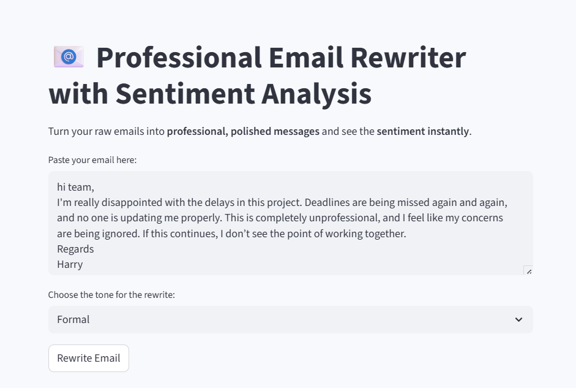
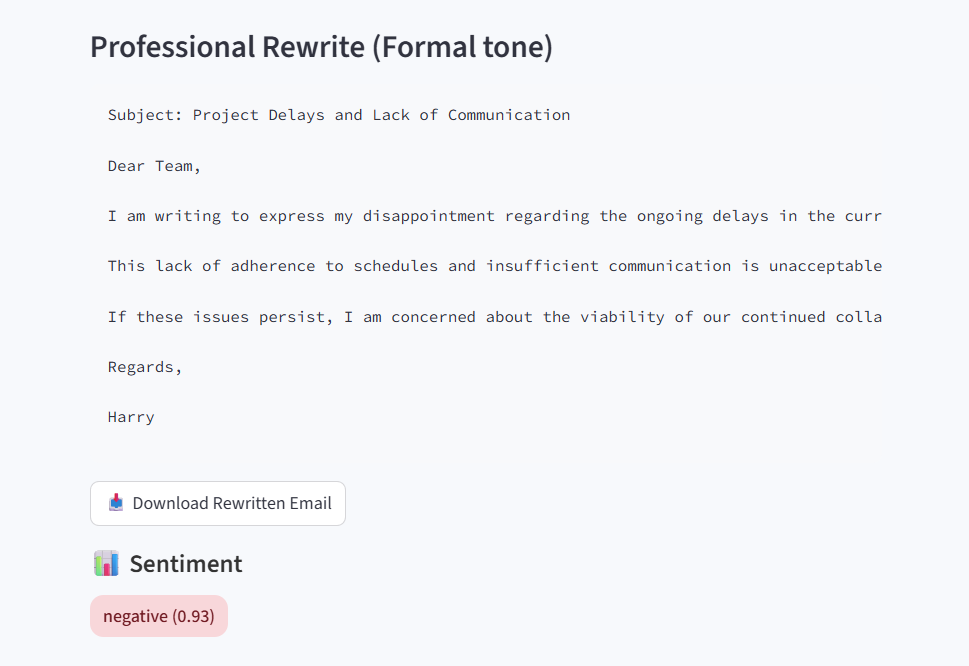
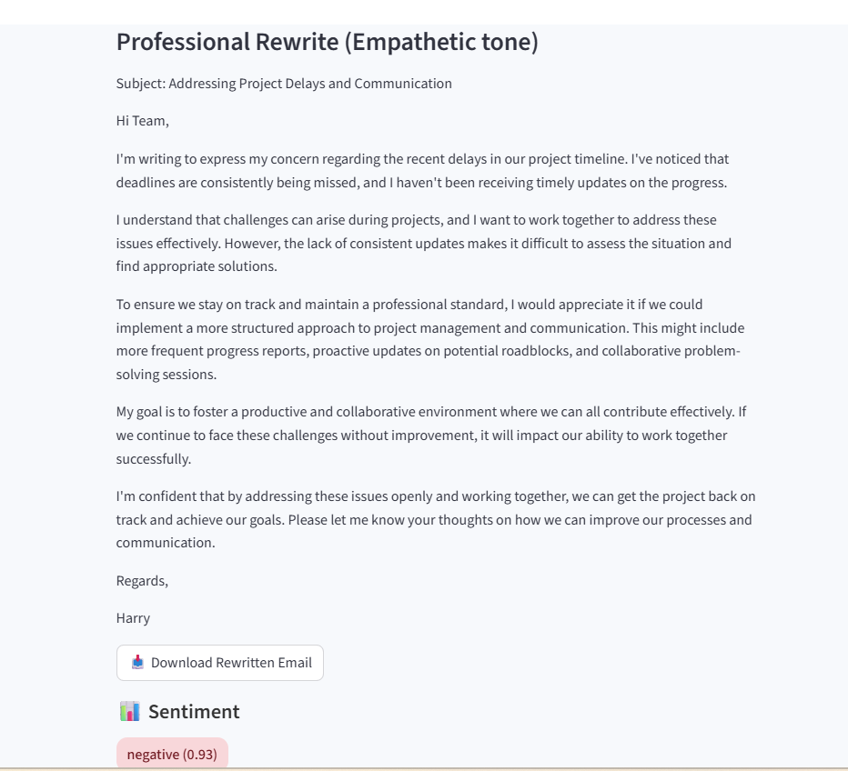

**📧 Professional Email Rewriter with Sentiment Analysis**

Turn your raw emails into polished, professional, and tone-optimized messages, while instantly checking their sentiment.

Built with Streamlit, powered by LLMs & Hugging Face Sentiment Analysis.

**🚀 Features**

1. Raw Email Input → Paste any draft email

2. AI Email Rewriter → Instantly generates a clean, professional version

3. Tone Selection → Choose from Formal, Friendly, Concise, Empathetic

4. Sentiment Analysis → Detects if your email is Positive, Neutral, or Negative

5. Download Option → Save the rewritten email as a .txt file

6. Modern Streamlit UI → Minimal, responsive design with a React-like feel

**🖥️ Demo**

Enter your rough draft email

Select the desired tone (Formal / Friendly / Concise / Empathetic)

Get a refined, professional rewrite + sentiment analysis

Download the polished version as a .txt file

**📧 Email Tone Transformation Demo**
This tool can transform the same raw email into different professional tones.

🔹 Raw Email (Negative Sentiment)

🔹 Formal Tone Output

🔹 Empathetic Tone Output

**⚡ Installation & Usage**
Clone the repo:

git clone https://github.com/Faisal-58/agentic-email-rewriter.git

**Install dependencies:**

uv add -r requirements.txt
Run the app:

streamlit run email_rewriter.py

**🛠️ Tech Stack**

Python 3.11

Streamlit – interactive UI

Hugging Face Transformers – sentiment analysis

CrewAI + Gemini – tone-based rewriting

**🎯 Why This Project?**

1. Writing professional emails under pressure is tough. This tool helps by:

2. Making messages clear and polished

3. Giving you control over tone

4. Highlighting sentiment to avoid negative impressions

5. Saving time with ready-to-send drafts

**👨‍💻 Author**

Faisal Ijaz

🔗 [LinkedIn](https://www.linkedin.com/in/faisal-ijaz-44524179/) | 💻 [GitHub](https://github.com/Faisal-58)
